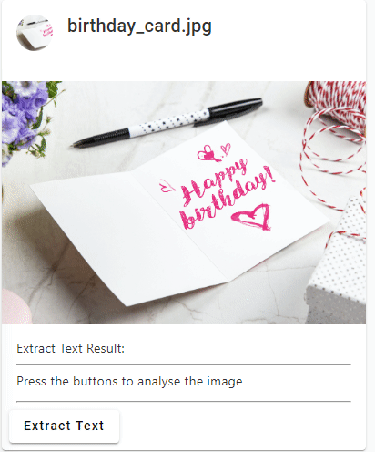
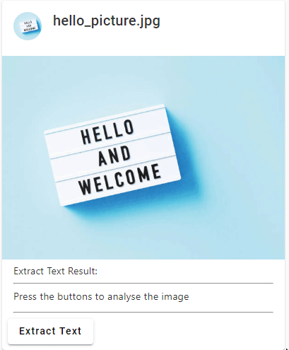
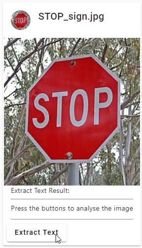
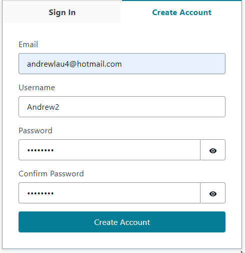
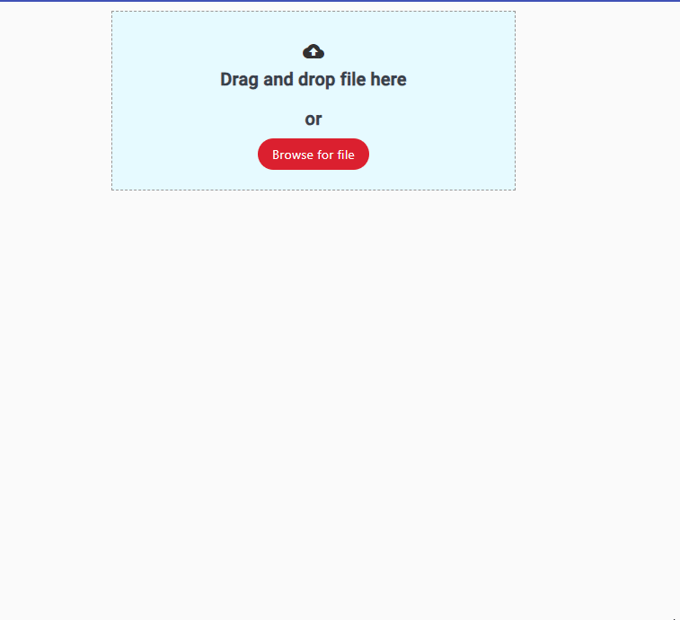
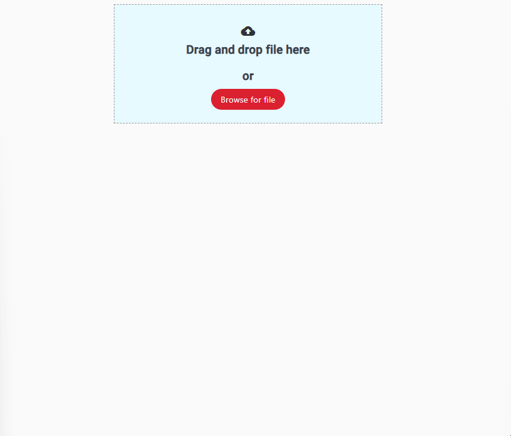

# AWS Angular Integrate Demo Using AWS Image Rekognition

## Demonstrate Extracting Text from Image
This project is the front-end application that demonstrates using AWS Rekognition to extract text from image.
The backend AWS infrastructure is setup using terraform and you can find the [full source here](https://github.com/andrewlau4/aws-serverless-backend-terraform).

The following pictures show what this application does:

#### Extract the words 'Happy Birthday!' from image (see the description text changed after button pressed)

#### Extract the words 'Hello And Welcome' from image

#### Extract the word 'Stop' from Stop Sign image

## Project Configuration
First run this [terraform project](https://github.com/andrewlau4/aws-serverless-backend-terraform) to set up the backend infrastructure on AWS.

The terraform will create all the resources, and then output all the resource Ids on screen. You need to use those Ids to fill in the configuration file, [here for production](src/environments/environment.ts) and [here for development](src/environments/environment.development.ts)

## Other AWS functions
Along the way, this project also demonstrates the following AWS functionalities:

* User signup and signin using AWS Cognito, using emails to verify user's identity.
* S3 files upload to user's private 'folder' (i.e. each user has there own private 'folder' and is not possible for other users to retrieve those files)

### User signup and signin using AWS Cognito

All the user management are provided by AWS Cognito. When the user first sign up, a email is sent with a code, the user has to enter the code to confirm the signup.

### File upload

Files are uploaded to each user's own private 'subfolder' in AWS S3 bucket; therefore other users cannot see your uploaded files. 

Only image file can be uploaded, the application contains logic to check the type of file being uploaded. If the file type is not image, the drop box will turn red, and an error message will be shown.

If the file type is valid, the drop area will turn green, and the picture will show after the upload is completed.

## Development server

Run `ng serve` for a dev server. Navigate to `http://localhost:4200/`. The application will automatically reload if you change any of the source files.

## Build

Run `ng build` to build the project. The build artifacts will be stored in the `dist/` directory.

